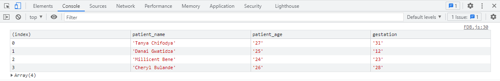

# FastDebug-Js
A tool to help web developers debug faster, cut down syntax, shows more information important to the developer
NB still under development, functions are still quite a few

## Functions
- console.log() faster with log().
 
<code>log("Hello World")</code>
<b>Hello world</b>
- check array using ViewList(Array), checks if is array and displays results in a table.
 
<code> ViewList(hospital_data);</code>
 

 
- Check if server or remote resource is available  online("requast url").
 
<code>online('https://jsonplaceholder.typicode.com/todos/1')</code>
 
- See returned JSON data from fetch request JsonData("request url").
 
<code>JsonData('https://jsonplaceholder.typicode.com/todos/1')</code>
